### 基本背景

> GPA: 3.81/4 (rank 1/19)
>
> TOEFL: 98 and 105(第二次考出来这个成绩，只有少数学校使用)
>
> GRE: 155V+170Q+3W
>
> MIT学期交流
>
> 两篇SCI一区, 其中一篇一作
>
> 联系方式：644565983（QQ）

### 申请结果

> Offer  
> [PhD in Mechanical Engineering @ Boston University] (accepted)  
> [PhD in Mechanical Engineering @University of Minnesota]  
> [PhD in Mechanobiology Institute @ National University of Singapore]  
> [MS in Mechanical Engineering @ John Hopkins University]  
> Rej  
> [PhD in Bioengineering @ UC San Diego]   
> [PhD in Bioengineering @ UC Berkley]  
> [PhD in Mechanical Engineering @ MIT]  
> [PhD in Engineering and Applied Sciences @ Harvard University]  
> [PhD in Macromolecular Science and Engineering @ Michigan Engineering] (interviewed)  
> [PhD in Material Science and Engineering @ UC San Diego]  
> [PhD in Biomedical Engineering @ Brown University] (interviewed)  
> [PhD in Material Science and Engineering @ Northwestern University]  
> [PhD in Mechanical Engineering @ University of Pennsylvania]  
> [PhD in Biomedical Engineering @ Tufts University]  
> [PhD in Biomedical Engineering @ Worchester Polytechnic Institute]  
> Unknown  
> [PhD in Biomedical Engineering @ The Hongkong Polytechnic University]  
### 导语

我申请过程中的一些心得体会其实在前一阵的[生医工系公众号推送](https://mp.weixin.qq.com/s/g9oPMa2dWBFt-GuB1SsdCQ)中也说过了，包括MIT给的PS以及CV如何写作技巧链接等。另外请大家申请前务必查看由[数学系徐源诚学长](https://sustech-application.github.io/2020-Fall/#/grad-application/math/applied-mathematics/[US]-16-xuyuancheng)为大家介绍的整个申请流程框架结构等一系列general问题。因此我这里也就结合自己的申请结果当做案例分析了。    

首先可以看到的是我申请了很多很多很多很多很多学校，也抱着中彩票的心态吧。最后结果也可以看出，拒我的有好有差，收我的，也有好有差。所以大家不要怕不敢申好学校，如果恰好碰上哪个比较match的老师就有可能收到反套，这时候才是关键！如何套磁请见计算机系[谢丹宁学姐的分享](https://sustech-application.github.io/2020-Fall/#/grad-application/computer-science-and-engineering/[US]-15-xiedanning)。

很好相信大家已经看出来了我比较喜欢从歪门邪道收集资源了。这里我顺便也说说如何深度挖掘信息吧。

### 经验分享

I． 选学校/项目

​    i. 地理位置：想好自己的大方向（计算机在加州、生物医疗则波士顿），这直接决定了你在博士期间以及毕业之后身边的资源，毕竟老师也喜欢与邻近实验室合作项目。仔细点的话知乎有着各种学校的生活体验以及交通便利程度等。

​    ii. 排名: 美国学校一般都看US NEWS，综合排名是给本科生看的，研究生主要看专业的单项排名。

​    iii. admission statistic/data: 歪门邪道中的旁门左道，很多学校不管你进入工学院哪个department/program，选导师都可以在工学院内任意选。这个信息直接决定了你并不需要进入到最好也是最难进的项目就能享受到同样的资源以及老师。因此学校官网直接搜索admission statistic，学校会显示近年来的录取率，国际生比例，男女比等。

给大家拿MIT的举个例子，我选了下biology department，这里便显示出历年男女、录取比例等其他信息我就没截图了。

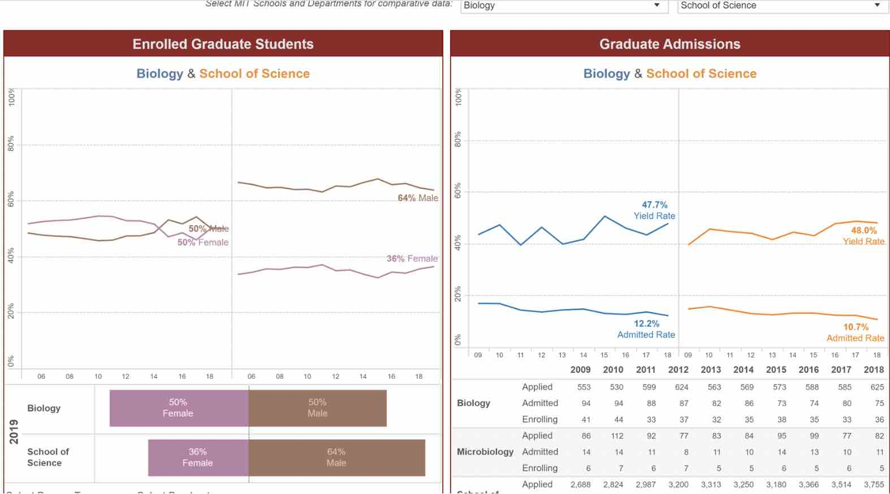

像这样的表单能告诉我们什么呢，就是说如果这个program录取人数每年都很低的话就说明很难录取，国际生比例少可能是他们在资金上有限制（国际生很多奖学金没法申请），女生比例少他们为了diversity可能对女生有照顾之类的。需要注意的是，这里的graduate students包括了研究生和PhD。

少数学校没有这样的表单（例如波士顿大学），不过通过各项目的US NEWS排名也能看出申请的难易程度。 

因此大家可以选择录取难度不是那么高却又跟自己研究方向相近的项目去申请，进去学校再找别的系的老师就方便多了。BTW, 机械系真的什么都做！

​    iv. 学校风评：知乎，一亩三分地，US NEWS。看看学校的就业情况。前两者可以看出在中国的口碑。而US NEWS中给出的数据也是从美国人的角度做出的评价。

​    v. 录取时间预测：gradcafe [https://www.thegradcafe.com/](https://www.thegradcafe.com/)。国际版一亩三分地。很多人收到offer就会在网上post出来，查询学校及其对应项目即可查看往年offer发放时间以及当年offer是否已经发过（有些学校可能是rolling制，这周没收到可能下周还有一波）。另外也有很多人在上面讨论自己的选择心路历程之类的。以下为网站内容示例。

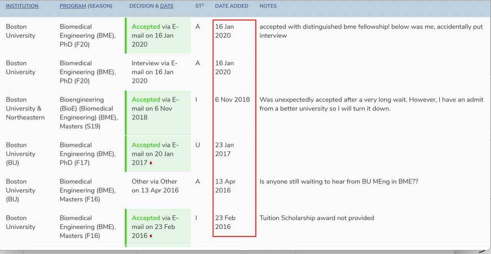

> 我在gradcafe中搜索Boston University, BME

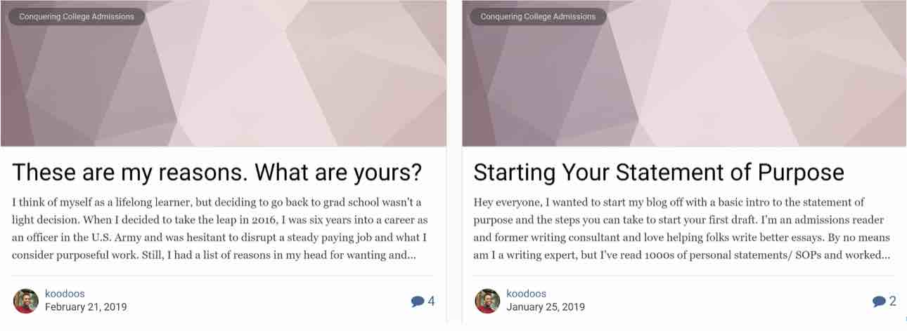

> 一些人也会在blogs中post申请感悟

​    vi. 选择：看好的学校先申请了再说，纠结最后去哪的事以后再想。建议大家在make final decision的时候想清楚自己读PhD最看重的是什么。地理位置（周边资源以及生活的便利程度），排名or导师。哪所学校最能满足自己最看重的点就选了，其他次要因素就不要比来比去徒增烦恼了。

II. 选导师

​    i. publication: google scholar（需翻墙），通常来说老师的研究方向与自己match的比较好聊天，老师也容易对我们感兴趣。这里match指的是自己的技能/研究内容正是老师所需要的。

​	ii. bio: 学校官网的老师主页，推测老师毕业年份，既可以让自己在看他的citation时有个心理预估也可以帮助判断其expectation。刚起步的老师一般会想要很多产出，比较push，厉害的老师（自己结合citation感受）能让自己在PhD阶段收获很多。步入教职很久的老师可能已经拿到了tenure，大佬级别，如果不是特别match还挺难套的，好处是他们已经是一个领域的领军人物，过的是不是更清闲我不知道，项目前沿break the boundary是一定的。自行把握想找的老师吧。

​	另外如果是中国人bio还能告诉你他什么时候来到的国外。

​    iii. citation, H-index, i-10 index: 直接搜名字加google scholar（需翻墙）, citation要结合bio一起看，刚刚起步的可能citation确实不多，这时候看看H-index与i-10 index，文章质量高的也很厉害。

​    iii. connection: 近期publication。 是否和以前的老板（结合bio）有合作，有合作的话自己入了它的组便也可能多一份大佬资源。和外校是否有合作，国际上还是附近公司/医院。

​    iv. industrialization/purely academic：官网介绍或者lab website中一般会写，或者自己感受其科研方向有没有可能步入社会实际应用。想好自己长远的方向找老师。

​    v. group members: lab website中。看看集体照，比如我看到活泼一点的就会心理上倾向觉得这个组比较轻松。都是外国人或者都是亚洲人的情况就会有些复杂（纯客观陈述，不带有任何偏见色彩，具体情况需要多方面分析，反正可以留意一下）。另外也能预测一下自己在这个组内工作的社交环境。

​    vi. 资金状况：grantome [https://grantome.com/](https://grantome.com/)_，the entirety of funding information。有钱的老师成功率更大呀。 顺便也可以看看老师正在做的项目都有什么。

不知道怎么判断老师是否有钱的话可以拿一个自己认识的老师做比较。根据不同研究领域也有不同的funding大概范围。

下面做个演示，比如我搜索我们BME创系主任郭老师，可以注意的是左边的filter有很多分类，另外这些funding点进去要看仔细是否是自己要找的老师（可能出现重名）以及是否合同期限还在。

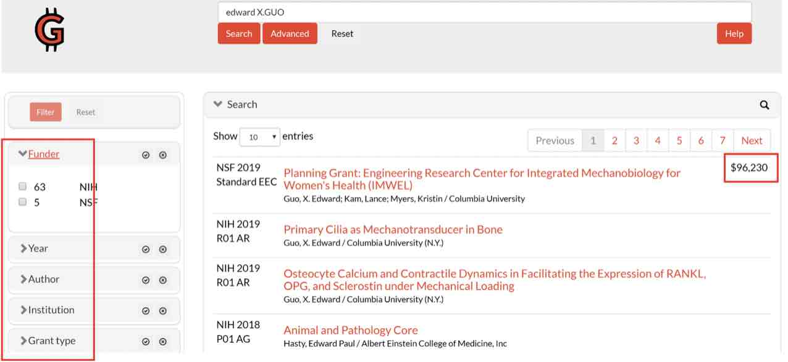

### 个人案例分析 

我印象深的几个学校：

**Brown BME**

一定要套磁！之后才有可能入committee的法眼。

当时收到了对方教授发给我的反套邮件，大概意思是希望做我的PhD sponsor，邀请我去学校参加面试。去了之后才了解到，布朗的BME是需要得到教授的邀请才能参加面试的，而面试是否通过又是由committee决定。并且他们在选人的时候是希望有in-person interaction的，光这个条件就把许多国际生不予考虑了，我是因为正好在美国才能有的机会被邀请。

面试当天我们需要跟不同的教授（4-5个）每人单独聊半小时，这个时候能让教授保持说话不尴尬技能就显得相当重要了（我大概就是因为不会聊天而被淘汰的吧）。另外他们也会从跟我们的聊天中感受我们收到offer后接受的可能性。布朗每年的接受率都很高大概也是他们在面试发offer的时候就会把这个考量进去了。因此表现出对他们极大的兴趣这点也很重要（怪我知道的太晚）。

因此我这里的建议就是，如果没有套磁到布朗的教授，就不要浪费钱去申请了。

**MIT MechE**

强committee

在MIT学习时跟很多PhD学生也聊过，MIT没有面试，只有committee决定收哪些学生。被录取的学生有发过paper也有没发过的。学生的水平确实不低，但给我感觉还是有一点中彩票的性质吧，建议大家都可以试试，多申几个program，说不定就中了！

另外英语成绩不用担心，很多department都有waive政策，即使不waive老师也基本不看。我的老师也跟我们说他们第一个看的就是推荐信，因此重要的还是推荐信！

EECS每年招的学生都很多，我一门课中的队友当时就是被机械系放在waitlist，收到了EECS offer来的。

生物工程招的很少很少很少。我认识的一位在MIT生物工程系做technician的也被拒了（侧面证明在一个实验室工作被一个老师赏识并不能改变结果）。

**UMich**

可套磁

学校很大很漂亮。文理通吃的好学校，工科强校。当时套磁了一位老师对我还挺感兴趣，后来发邮件跟我说今年忽然不打算招生了。不过还是鼓励大家套磁，毕竟我离成功就差那么一点

**NUS(MBI)**

项目对南科大的学生很友好。我跟在那边的南科大的学长也有聊过，老师都很nice，新加坡生活相当潇洒，科研环境对想做生物力学的同学来说简直天堂。当时抱着dream school的想法申请的，后来因为太爱波士顿，还是忍痛拒了offer。

他们每年都会来南科大宣讲，南科大每年申请的人很多，因此招的也多（19和20年都发了3个）。20年我知道的是总共7个名额，最后给了南科大3个。

与两位教授分别/共同面试（看老师时间安排），要有对自己研究领域的深刻理解，看看大佬的review，目前研究的challenges，为什么会有这个问题。自己对生物力学的想法。顺嘴可以提一下以及感兴趣的MBI教授来表现出自己对加入他们的兴趣，最后记得发邮件感谢老师的面试。

**明尼苏达大学MechE**

Committee。由于错过截止日期半个月，不过看到学校官网显示截止日期之后还可以申请，只是录取率极低，还是想试试就先发了一封邮件给一位老师打算套磁增加一点录取概率。收到老师回复说他们committee决定是否录取，现在讨论能否做他的PhD还为时过早，我就懂了。。

最后收到offer又去跟这个老师聊了一下，就，没有然后了。

不过这学校的附属医院是全美top1，对想做生物医疗方向研究的同学来说还是一个好地方吧。就是想申的同学不用考虑套磁这种麻烦事了。

**HK Poly U**

导师主导。

港校录取流程可能我也不太懂，也是当时港理工一位老师找到的我想收我做PhD。我也就硬着头皮试试了。申请下来只记得交了很多资料，申请过程比美国麻烦很多。不过在这过程中那边的老师还帮了我很多，还是挺感激的吧。

亲测录取几乎是老师主导的，虽然有committee面试，短短10分钟，聊聊自己做过的，想做的，接受offer的可能性，就结束了。

**BU MechE**

Committee

因为在波士顿的生活而爱上了这座城市，生物医疗科研环境深深吸引着我报了BU。

选择项目的时候正是想了想BME强校，竞争激烈，因此错峰报的机械系（因为看到机械系很多老师都是 cross affiliated）。也是自己申请季收到的第一份offer，给的是和哈佛MIT一样数额的fellowship。

全程没有套磁（也可以说是没有成功的套磁），第一年rotation，轮转2-3个实验室第二年做决定也是很好的。我也有认识套磁收到offer的，即offer中写明sponsor是哪位老师。因此目测套磁或者直接申都可以。

---

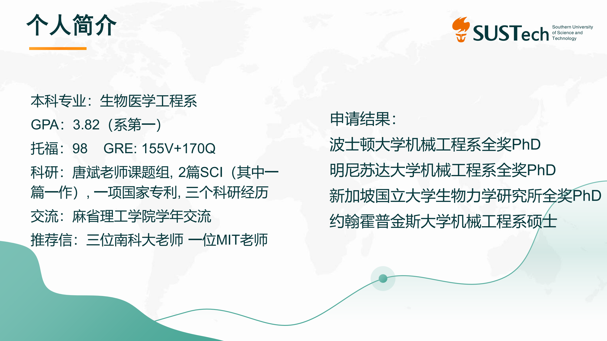

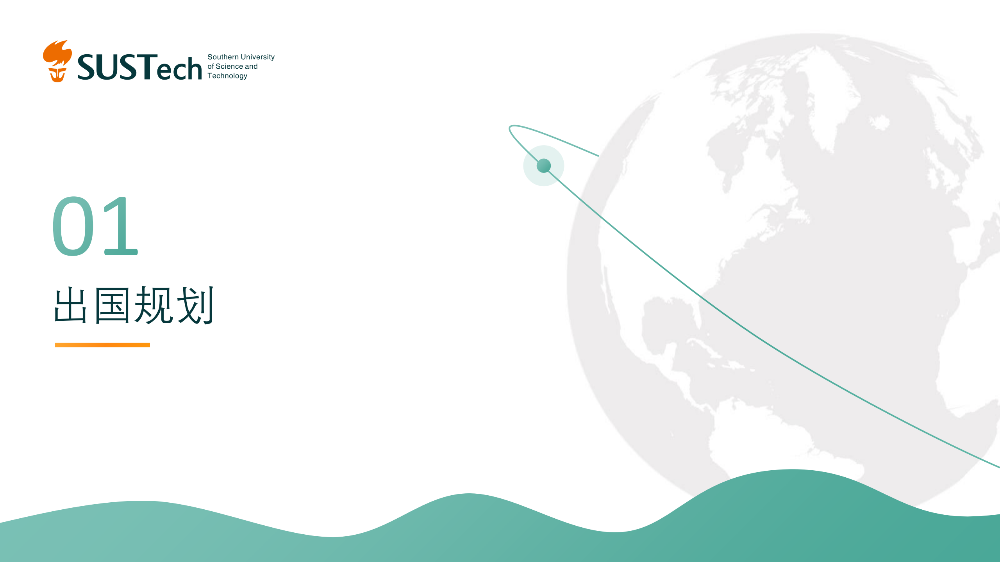

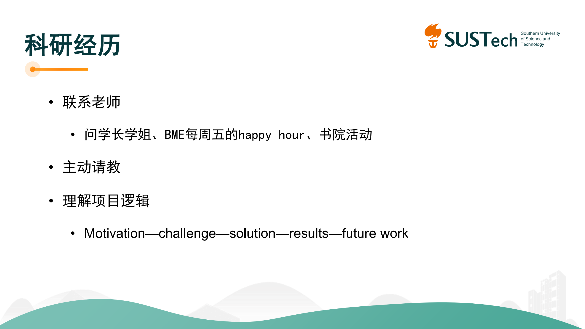

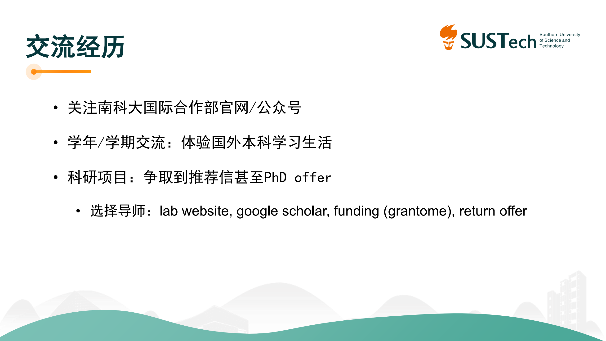

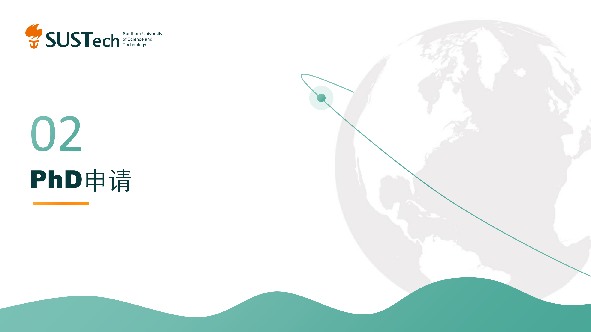

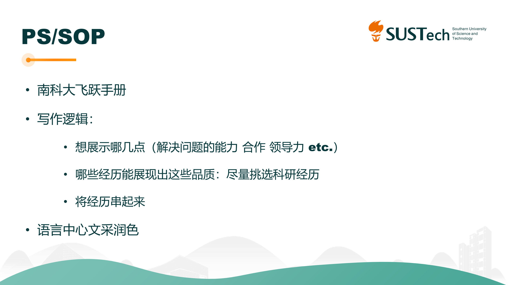

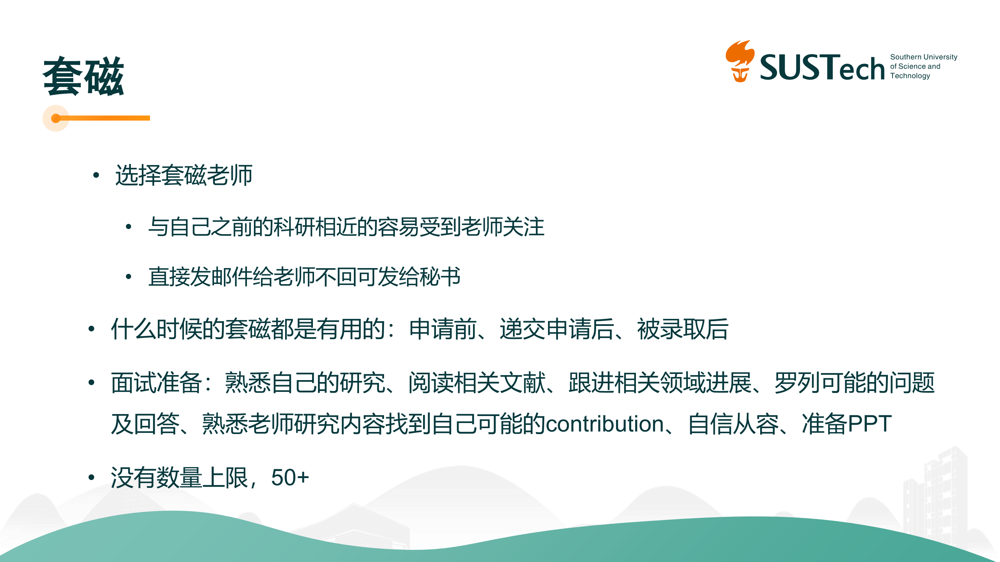

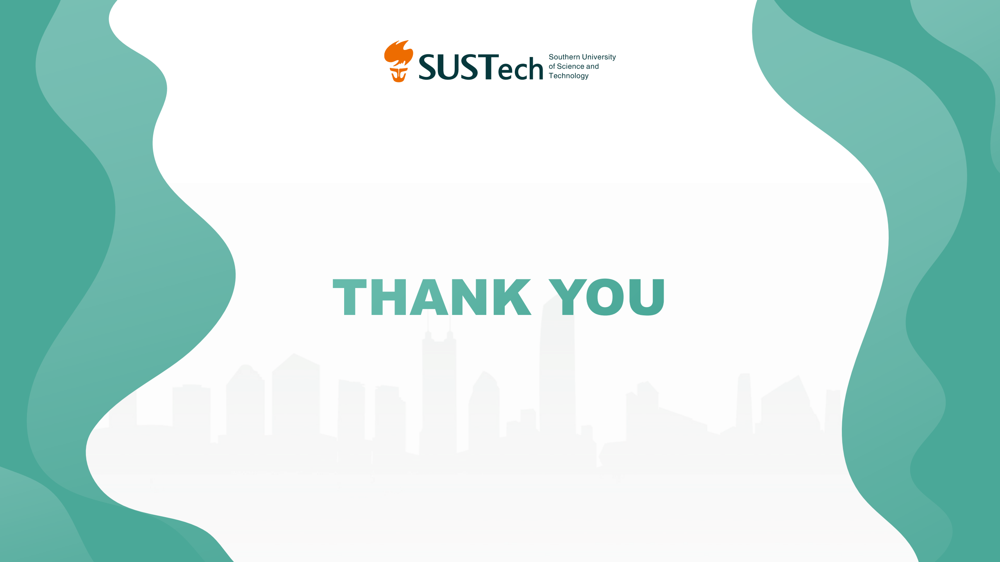
