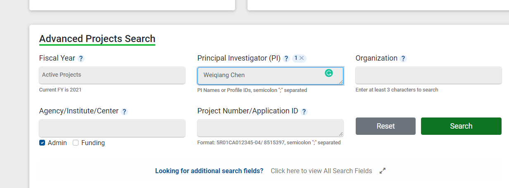

## 基本背景

> 姓名：高旭
>
> 专业：生物医学工程
>
> GPA：3.88/4.0
>
> Rank: 2/20
>
> TOEFL: 104
>
> GRE： V160+Q170+AW4.0
>
> IELTS: 7.0
>
> 一篇SCI一区二作，一篇审核中
>
> 联系方式：2870208968 （微信QQ同号）

## 申请结果

> National University of Singapore (Phd in biomedical engineering)
>
> The University of Delaware (Phd in biomedical engineering)
>
> Tokyo University (Master in biomedical engineering)
>
> Carnegie Mellon University (Master in biomedical engineering)
>
> Delft University of Technology (Master in biomedical engineering)

## 经验分享

导语：2020年受到疫情的影响，整个留学申请都受到很大的影响。自己申请时候无科研文章，课题才开始进行，无暑研经历，无交换经历。所以我当时申请的时候压力很大，从根本不知道我有什么资格可以被录取到最后的nus的博士录取。这里要非常感谢我的学术导师郭琼玉导师，在每一个环节都给我耐心的指导。从前期的选校套磁，到文书的精雕细琢，推荐信的内容，后续面试准备，都要花非常多的精力。接下来就针对申请博士的这些方面讲一些个人体会。关于是否要读博士，前面已经有很大人分享了我就不再说了。

###  选校套磁

因为博士期间的主要任务是科研，所以学校的学术水平和导师能力非常重要。我第一参考的是各大学校排名或者专业排名（QS，US News，泰晤士等等）。根据自己的喜好（比如当地的文化，气候，对华态度，地理位置），对想申请的学校划分三个梯队（类似第一二三志愿），每个梯队4-6所学校。因为美国的生物医学方面相对其他地方发展的确实不错，我大部分都是申请的美国学校。在确定好学校之后呢，大家一定要花时间去每个学校自己所在专业的官网，查看项目申请截止日期，需要一些什么材料，几封推荐信，语言成绩要求（送分代码，入学前有效还是申请前有效），所在地址，相关网址用一个excel表格统计起来。如下图，

了解完这些之后，先看自己的英语成绩是否满足以上所有学校，如果不满足可以赶紧准备起来，或者换其他学校申请。

收集完这些信息之后，就要去faculty查看自己的意向导师，一个学校大概选2-5个。学校官网一般会给每个老师设置自己实验室的网址，那里就能获得非常多的信息。比如实验室的成员如看华裔或者中国学生多不多，成员的背景学校（看他们的出身和南科大比比），入学年份（如果近两年没有招聘学生可能今年录取几率大一点）。最重要的是导师的publication和正在进行的实验项目。根据导师发文章的频率，期刊级别能大致判断这个导师的学术能力。（当然文章少也不一定说导师能力差，可能这个方向确实难发文章，但对文章数量有要求的同学可以考虑这一点）。看现在的研究课题你是否感兴趣，是否具有potential，这时候你可以把这些方向都和自己的学术导师聊聊，以他们的经历和眼界，能给出更有针对性的建议。关于这里有一个问题就是，想去的课题组和我自己本科做的没有关联，能不能申请？我的看法是肯定可以的，技能操作都可以培养学习，但是兴趣是很难培养起来的。如果你对这个方向有浓厚的兴趣，那你就会主动的去学这些，主动的去探索背后的问题，想办法解决问题。这个在导师选学生的时候是很重要的参考一点。当然如果你有这些背景肯定是加分项，但不起决定性作用。比如我本科做去细胞肾脏模型的，我之后要去的实验室是做干细胞迁移，生物力学的，两者唯一有联系的是课题名字都有细胞（哈哈哈哈），但是对面导师还是接受了我。所以大家不要太担心。最后也用一个excel表格把这些教授的信息记录下来（之前尝试大脑记忆，但劝大家还是老老实实归档，可以为后面套磁，提交材料省下不少时间）

收集完这些之后就是九月份了，可以开始准备套磁了。套磁一般一个学校先只套一个（第一个套磁的对象可以是你最想去的课题组，也可以是你觉得录取几率比较大的组。那录取几率怎么大致判断呢？以美国为例子，教授们需要申请到项目funding才有钱去招聘学生。有一个网址https://projectreporter.nih.gov/reporter_searchresults.cfm可以查到教授是否申请到NIH的funding，在里面搜索目标导师会弹出以下结果。

可以看到这个教授在2020年申请到了一个新项目，那肯定会马上招学生干活，那这种录取几率就相对大一点。而且可以从这里看到你博士期间主要的课题会是什么。）确定好之后，开始写套磁信，套磁信大概格式是第一段话精简的介绍自己，第二段写你对他课题感兴趣，有什么想法，或者想对什么一起探讨以下。（关于套磁信，PS，SOP，CV这些文件如果大家想要参考可以私下联系我）。一般一个学校一次只套一个，如果一周没有回复可以套下一个。最好不要同时给两个教授发邮件。每封套磁信开头最好加上mail address的抬头，我导师说这样会比较专业和礼貌。每封邮件附上自己的成绩单，CV，publication（如果有的话）。

### 文书书写

第一个重要的文书就是CV个人简历，因为这个是套磁时候老师唯一了解你过去经历的材料。CV一般是1-2页，不要太多，太多了老师也不愿意看下去。网上的简历模板有很多，选一个中规中矩的即可。如果有出国交换经历，可以在最开始背景部分就写。有publication的话建议放到第二部分写，顺序从一作到其他作者排列，把自己名字加粗，期刊影响因子和分区在后面写上，publication按照全名引用的格式写（最好有doi，有些老师可能直接想点过去看你的文章）。之后再写项目。到项目的时候一般是标题，年份，你的角色，你的贡献或者课题意义。按照发表文章，文章再投，课题已结束但文章没写好，参与文章或者课题的顺序排列。如果是一页的话，这些内容已经足够了。如果想写两页，可以再加一栏你会的实验技能，课程项目经历，获奖经历，等等。

第二个部分是网申的PS和SOP。这个我建议大家从九月份就可以开始写了。那个时候可以先围绕这几个点想好答案，并把他们用英文写出来，先不管字数。为什么学这个专业，你的长期目标，你大学课程和科研表现，有什么过人的能力，为什么去这个学校，为什么读博。这个是需要花时间去想的，刚好也是给自己一个冷静期捋一捋自己三年来的所有经历。写完这些之后总体框架就有了，文书的肉体也有了，接下来就是做好骨架，练好体型，减减脂肪。一个词来说就是英文写作。大家通过阅读文献和英语标化考试应该有一定的底子了，但可能在刚开始写的时候就会变成这样，比如第一段写自己为什么感兴趣，

Before entering Southern University of Science and Technology (SUSTech) as an undergraduate, my grandfather received treatment in a hospital on account of severe arteriosclerosis. A stent was placed in the aorta, which significantly alleviated his symptoms. I was marveled at this tiny object for how it could cure my grandfather’s disease. The doctor illustrated that this stent owned the property of shape memory, indicating it could transform from an enterable form into the shape expected after activation, thus expanding the narrow aorta. Besides, the drug was loaded in the stent and would be released after being distended. This immediately arrested my interest and a preliminary concept of biomedical engineering was formulated in my mind. With my predilection for medicine and biology, biomedical engineering became my first choice after being matriculated in SUSTech, and I wish I could make every endeavor to help handle current thorny medical diseases in the future.

但这个介绍就比较累赘，而且句与句之间联系不紧密，并不能看出你是否很具有motivation和potential。这两个词很重要，一定要多用积极主动的语态词，突出你是很感兴趣的。这里推荐语言中心的文书服务，可以帮助改一下语序问题和基本语法。改完之后建议拿给自己的导师看看，因为他能帮助你判断哪些内容是国外教授更加青睐的内容，以及是否有含金量。在经历n多次修改之后变成了如下，

I have long been fascinated by the use of biomedical engineering as a tool, which focuses on integrating chemistry, biology, materials, mechanics, and medicine, for providing feasible treatment of current clinical issues. When I was in tenth grade, my grandfather received hospital treatment for severe arteriosclerosis. A stent was placed in his aorta, and this significantly alleviated his symptoms. I was in awe of this tiny object which was made by a biomedical engineer and how it was able to help cure my grandfather’s disease. This immediately awakened my interest and a preliminary concept of biomedical engineering was formed in my mind. 关于其他模块如为什么读博士，长期目标，等等就不一一赘述了，

总之，大家可以多参考学长学姐的文书内容，或者学校发布的文书典范，进行合理的改写换到自己身上来。尽量做到每个问题的答案里面的每句话都不是多余的。再结合不同学校的字数要求，内容要求，进行组合排布，一篇文书就这样完成了。大概完成时间为9-11月份。

### 套磁信内容

一般美国要准备三封推荐信，亚洲这边可能只需要两封。所以建议大家尽量准备三封。自己的学术导师是肯定需要的，因为他是最了解你的，在写起来的时候就会特别真实以及可信。有些导师可能会帮你写，那是最好的了。如果需要自己写，写的内容我是按照老师自我介绍，怎样认识到这个学生，这个学生在我实验室做了些什么，他有什么东西让我难忘，或者是让我相信他之后会成功的理由，他具有哪些读博的品质。总体表现出老师对这个学生很满意，很愿意推荐他去那边读博的感觉。

第二封可以选择自己的课程老师或者其他项目老师，一定要有关联，而不是看重他的头衔才去请他写。就算他愿意，你没上过他的课也没在他实验室干活，推荐信的内容也没有，写出来也是很空套的话。这样的推荐信就比较没有价值。在有关联之后，尽量选择头衔高的，如果有交流经历可以问问交流学校的老师愿不愿意帮你写（据说国外大学的导师推荐信更有含金量）。推荐信和套磁信一样也要有抬头，也就是mail address。以下是一段例子，

> Xu first deeply impressed me with his extraordinary intelligence and motivation. When he was only a sophomore, Xu contacted and showed me his great interest in my research area. I left him with a review article about endovascular embolization therapy to familiarize with my field of focus. He soon came back with a one-page English assay to describe his understanding of the article as well as a few valuable thoughts behind the paper. Therefore, I was delighted to let him join my group. Xu quickly got along with the senior members in the laboratory and developed strong interest in a shape memory polymer project, i.e. harnessing shape recovery of miniaturized thermoplastic shape memory systems for embolization treatments. He learned basic research skills and performed very well in each task such as the fabrication of magnetic shape memory particles and development of ex vivo ischemia models. Despite the outbreak of COVID-19, Xu had to stayed at home for a whole semester but showed a strong will to participate in a review writing work about shape memory polymers for biomedical applications. Even though we were not able to have face-to-face talks, Xu always passionately discussed with me and other senior members for the writing work. He searched for nearly one hundred relevant articles and orderly categorizing them into tables and figures. Due to his great contribution, Xu was recognized as the second author in the review article, Advances in physiologically relevant actuation of shape memory polymers for biomedical applications, which was recently accepted by the journal Polymer Reviews (IF=7.304), one of the top-ranked and highly cited journals in the field of polymer science.

### 面试准备

当完成以上这些任务之后，一般就到一月份了或者二月初，这个时候等待面试通知，或者进行二轮套磁。因为有些教授可能9-11月份还无法确定自己的funding是否足够招聘新的博士，所以就没有回复。到1月份之后一般都会有确切的消息，这个时候再次给他发邮件表明你的意愿。这个时候发送规则和之前一样，但不过内容可以根据一月份各种课题的进度改改。在收到面试邀请之前，可以先想想博士面试的常见问题，很大一部分其实是CV的内容，但需要你在交流之中流利的表达出来，如为什么学这个专业，**你为什么要读博士（这个问题非常重要）**，为什么选择我们学校，长期职业目标，最大的优缺点，科研中也没有遇到什么难题以及你是怎么解决的，你理想的课题组或者导师是怎样子的。这些问题可以提前写好答案背下来。

收到面试邀请之后，在上面问题之外还要加上为什么你觉得你适合我们课题组，你来我们课题组想要什么，你需要去粗略的看一下这个导师的论文内容和动态。然后做好ppt，请自己的学术导师帮忙看一下或者在组会上练习也可以，导师肯定看过很多这种ppt，有很多个人经验。要对简历和ppt上面的东西了如指掌，合理包装而不是“过分”吹水。多找人模拟几遍，剩下的就在面试时候随机应变了。面试之后记得给对面发封感性的邮件，以示礼貌。

## 心得

总之，DIY申请这条路很辛苦，要做好心里准备，但也要相信自己。当时申请的时候，我总结自己的科研经历的时候发现真的很少，参与项目说的不好听可能就是在划水，文章也只有一篇综述二作（貌似综述文章含金量比科研类文章少很多）。但最后在老师的指导下和朋友的帮忙，才把一点一点把自己的价值挖掘出来，进行包装。所以我对我的申请结果很满意了。

关于英语考试，因为我三种都是一次过，所以很多人问我是怎么准备的。但我想说的是英语考试准备真的是靠自觉，课程或者网上经验都是辅助你的，但最后落实只能靠自己。关于我每次考试之前的schedule我的空间里面有，但每个人喜好不一样根据自身安排，重要的是坚持。如果找不到动力坚持，不妨报个考试，一次考试就是一千多，一般人肯定不想把这一千多浪费了，所以就会坚持。还有人经常埋怨没时间准备gre，说gre好难啊，科研任务又重，又学了25学分，还有各种社团活动，组织干部事情，还要学什么技能。这样的情况我一般建议就是，你想要的太多了，你要学会放弃，有舍才有得。大一大二自己想要的太多，最后发现自己有成果性的东西很少。可能我自己的目的性比较强，比较看重利益。大三的时候就开始舍弃很多，然后英语考试一次准备一次过，课程也能学的很好，组会上讲的东西越来越专业。如果需要英语资料也可以找我要哈。

 

最后祝大家能收到理想的offer！

